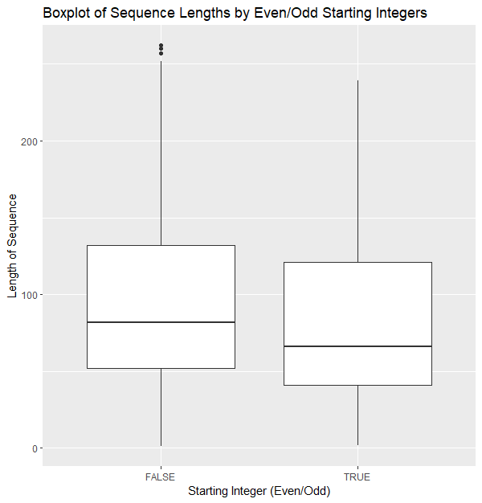
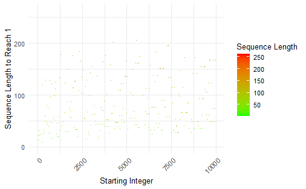

Collatz Conjecture
================

<!-- -->


#### Contribution declaration

- Task 1: @amirabarizah
- Task 2: @amirabarizah @mimihassan @ninazuhairi @hani-hive
- Task 3: @amirabarizah @mimihassan @ninazuhairi
- Task 4: @hani-hive
- Task 5: @mimihassan
- Task 6: @hani-hive
- README: @mimihassan
- RMarkdown: @mimihassan

## Summary of Collatz Conjecture Analysis

```Start```

|          | Value           | 
| ------------- |:-------------:| 
| Min.      | 1 | 
| 1st Quartile     | 2501      |   
| Median | 5000      |    
| Mean | 5000
| 3rd Quartile | 7500
| Max. | 10000

```Length``` 

|          | Value           | 
| ------------- |:-------------:| 
| Min.      | 1.00 | 
| 1st Quartile     | 46.00      |   
| Median | 74.00      |    
| Mean | 85.97
| 3rd Quartile | 126.00
| Max. | 262.00

 ```Max Value```
|          | Value           | 
| ------------- |:-------------:| 
| Min.      | 1 | 
| 1st Quartile     | 9232      |   
| Median | 13336      |    
| Mean | 58996
| 3rd Quartile | 32272
| Max. | 27114424  

```Even/Odd Statistic Summary```

| Start Type        | Average Length           | Standard Deviation Length  |
| ------------- |:-------------:| -----:|
| Even     | 79.5936 | 45.10308 |
| Odd      | 92.3396      |   47.18387 |


## Task 4: iii) Length Sequence of Even and Odd integers Boxplot

<!-- -->

## Task 6: Sequence Length Heatmap

<!-- -->


